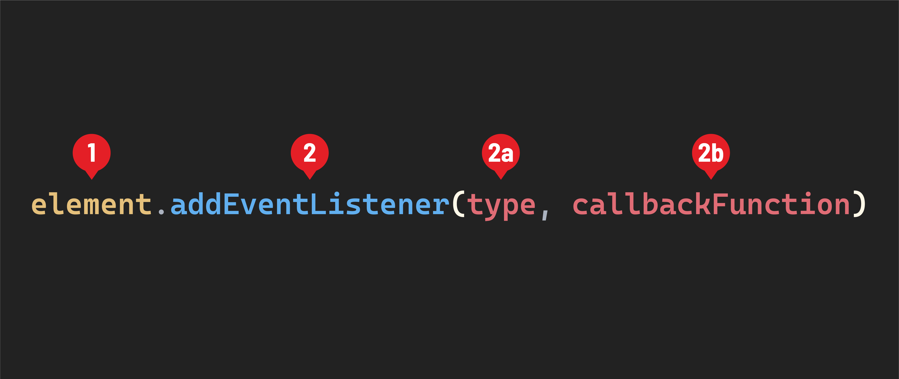

# 

**Learning objective:** By the end of this lesson, students will be able to compose event listeners with appropriate syntax.

## Listening to events

We use the [`addEventListener()`](https://developer.mozilla.org/en-US/docs/Web/API/EventTarget/addEventListener) method to add events to DOM elements. Here is the common syntax for doing this:



1. The element we want to add an event to.
2. The `addEventListener()` method. It accepts two arguments:

   2a. The `type`. This should be a string and indicates the event that the event listener will respond to.

   2b. The `callbackFunction`. The `callbackFunction` is a callback function that will be executed when the event `type` we've specified happens on the `element` we've specified.


As a reminder, a callback function is a function passed into another function as an argument. You might recall using callback functions with the `forEach()` method. The callback function provided to the `forEach()` method is executed once for every item inside an array.

The `callbackFunction` above functions in a very similar way, but the code inside of it will be executed in response to an event on the corresponding element.

> ♻️ Repeatable Pattern: When working directly with the DOM, we always use the `addEventListener()` method to attach event listeners to elements.

## The `'click'` event

Let's build an event listener that will respond to one of the most common types of events - the `'click'` event. We'll add this to the `<button id="like-button">` element we created during setup.

An element receives a [`'click'` event](https://developer.mozilla.org/en-US/docs/Web/API/Element/click_event) when a mouse's primary mouse button is pressed and released. Other pointing devices can trigger a `'click'` event, such as a finger tapping the element on a mobile device with a touch screen. However, we'll primarily be working with mouse clicks.

Let's start by selecting the `<button id="like-button">` element from the DOM and create a variable called `likeButtonElement` to keep track of it.

```javascript
const likeButtonElement = document.querySelector('#like-button');
console.dir(likeButtonElement);
```

After you've confirmed that you've selected the `<button id="like-button">` element from the DOM, you can remove the `console.dir()`.

After that, attach our first event listener to that element. To listen for a click event, pass the string `'click'` as the `type`. The callback function will log the string `'You clicked me!'`: 

```javascript
likeButtonElement.addEventListener('click', () => {
  console.log('You clicked me!');
});
```

Return to your browser and open your DevTools. Click on the `<button id="like-button">` element in the browser. You should see a message logged to the console: `'You clicked me!'` - congrats! You've built your first event listener!

## ❓ Review Questions

- Which of the following is not a part of the syntax for creating an event listener?
	- The element on which the event occurred
	- The kind of event that took place?
	- The callback function that is executed in response to the event
	- The time at which the event occurred
- How many arguments does `addEventListener` accept?
- Where have we seen callback functions before?
