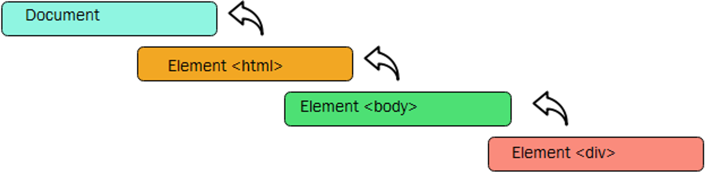

# DOM Events - Level Up - Event Bubbling


When an event occurs on an element, that event, whether it is listened to on that element or not, bubbles up through the DOM until it reaches the `document` object.

[tktk better asset from Hunter]



All event listeners registered for the same event, such as `click`, will be invoked along the path to the `document` element - unless one of those listeners calls the event object’s `stopPropagation` method. 

Let’s see some bubbling in action. Add the following to your `index.html`:

```html
<form>This is the form
  <div>This is the div
    <p>This is the p</p>
  </div>
</form>
```

Next, in `js/app.js`, attach a 'click' listener to each element: 

```javascript
const formElement = document.querySelector('form')
const divElement = document.querySelector('div')
const pElement = document.querySelector('p')

formElement.addEventListener('click', () => {
  console.log('form')
})

divElement.addEventListener('click', () => {
  console.log('div')
})

pElement.addEventListener('click', () => {
  console.log('p')
})
```

In your browser, click on each element and examine the console! 

