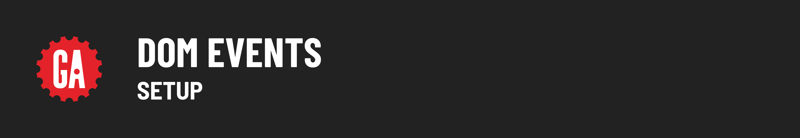

# 

Open your Terminal application and navigate to your `~/code/ga/lectures` directory:

```bash
cd ~/code/ga/lectures
```

Create a new folder named `dom-events` and enter it:

```bash
mkdir dom-events
cd dom-events
```

Inside the `dom-events` folder, make two more folders: `js` for JavaScript files and `css` for CSS files:

```bash
mkdir js css
```

Now, let's create the necessary files.

 - In the dom-events folder, create an index.html file.
 - In the js folder, create an app.js file.
 - In the css folder, create a style.css file.

```bash
touch index.html ./js/app.js ./css/style.css
```

Now, open your project folder in VS Code:

```bash
code .
```

In the `index.html` file, add HTML boilerplate by typing `!` and hitting the `Tab` key. Then, link your `app.js` file by adding this line inside the `<head>` tag:

```html
<script defer src="./js/app.js"></script>
```

Next, link your `style.css` file:

<link rel="stylesheet" href="./css/style.css">

Inside the `style.css` file, add the following CSS starter code:

```css
body {
  font-family: system-ui, sans-serif;
}

div {
  background-color: darkslategrey;
  /* This makes the width of the div the width required by its content! */
  width: fit-content;
  padding: 8px;
}

button {
  margin: 8px;
}

```

Next, let's add the following starter code inside of the `<body>` of our `index.html` file:

```html
  <h1 id="main-title">DOM Events Blog Post</h1>
  <p>DOM Events are the key to interactivity!</p>
  <div>
    <button id="like-button">Like this post!</button>
    <button id="dislike-button">Dislike this post!</button>
  </div>
```

Finally, open the `index.html` file in your browser.
